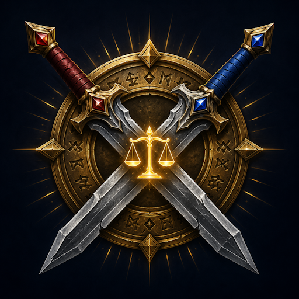

  

  # SplitWatch

  **Auto-split a 10–40 man raid into 2 balanced teams for split-mechanic encounters.**

  
  
  
  
  
  

---

> [!TIP]
> **Sources de poids disponibles :**
> - **Details! / Recount / Skada** — DPS + HPS live (le plus précis, recommandé)
> - **Item Level (inspect)** — pas besoin d'addon tiers, utilise l'API Blizzard `NotifyInspect`. Inspecte chaque membre du raid (~1.5s par joueur, portée 28y)
> - **Manuel** — sliders 1–100 par joueur sur l'onglet **Joueurs**
>
> Si aucun damage meter n'est chargé, le mode **Item Level** est un excellent fallback sans dépendance — il classe les joueurs par stuff plutôt que par performance, mais reste bien plus informatif que des poids manuels uniformes.

## What it does

SplitWatch reads your raid roster, runs a snake-distribution algorithm balanced across **tanks, healers (by HPS) and DPS (by damage)**, then applies optional **team-composition constraints** (battle-rez per team, Bloodlust per team, melee/ranged ratio, dispels…), and finally reassigns subgroups in one click via `SetRaidSubgroup`. Made for split-mechanic boss fights — Spirit Kings (MoP), and any other encounter that asks the raid to fight as two halves.

**0 required addons** — SplitWatch works standalone. Details!, Recount, and Skada are optional integrations: when loaded, the algorithm reads live DPS+HPS from them. Item Level mode uses Blizzard's inspect API for a zero-dependency stat-based ranking.

**Sister addon to [BossWatch](https://github.com/Timikana/BossWatch) and TankWatch** — shares side-tab navigation, gold-accent UI, and the family colour palette. Click between the three from the left edge of any panel.

## Features

- **Roster scanner** — reads your raid via `GetRaidRosterInfo` + `UnitGroupRolesAssigned`, infers role (TANK / HEALER / DAMAGER) and class
- **Snake-distribution algorithm** — tanks alternate, healers snake-distribute by HPS, DPS snake-distribute by damage; weakest player fills the gap on the larger team for uneven raids
- **Team-composition constraints** (Raid-Leader toggle, applied AFTER the snake distribution with minimal-disruption swaps):
  - ☑ Battle Rez per team — Druid / DK / Warlock *(default ON)*
  - ☑ Bloodlust per team — Shaman / Mage / Hunter / Evoker *(default ON)*
  - ☐ Balance melee vs ranged (class-based heuristic, refined by inspect-spec when available)
  - ☐ Mass Dispel per team — Priest
  - ☐ Decurse per team — Mage / Druid / Shaman
- **Manual locks** — pin a player on Team A or Team B before computing. Right-click a name in the Preview columns to open the lock menu, or use `/splitw lock <name> A|B|free`. The algorithm respects locks across all passes (snake distribution, size rebalance, constraint resolver, melee/ranged equaliser).
- **Named presets** — save the current constraints + locks + DPS source under a name; reload before a specific fight. UI on Réglages with save / load / delete buttons, or `/splitw preset save|load|delete <name>` / `list`.
- **Broadcast on Apply** — optionally auto-post the team rosters to chat (RAID / RAID_WARNING / PARTY / SAY) when a split is applied, so the raid sees who's on what team.
- **Per-player tooltips** on Preview team rows — hover a name to see class, role, DPS, HPS, manual weight, and lock status at a glance.
- **10-to-40 man support** — subgroups assigned dynamically (1 vs 2 / 1+2 vs 3+4 / 1+2+3 vs 4+5+6 / 1+2+3+4 vs 5+6+7+8)
- **Five weight sources** — Details!, Recount, Skada, Item Level (inspect), Manual sliders. Unavailable sources are greyed out and disabled in the dropdown.
- **Live source preview** — verify your damage meter is feeding data **before** computing a split; shows live DPS/HPS values for every roster member (or for all tracked actors when solo)
- **Before / after preview** — see each team's tank count, healer count, DPS count, total DPS score and total HPS score before applying. Per-player suffix (`[ilvl 432]` or `[245.6k]`) next to each name.
- **Permission-gated Apply** — only leader/assistant can mass-move; combat-locked `SetRaidSubgroup` calls deferred until `PLAYER_REGEN_ENABLED`
- **Resizable options panel** — drag the bottom-right grip; size + position persisted account-wide and clamped to current screen at load
- **Tabbed options panel** with collapsible sections, per-section reset button, page-level scrolling, Escape-to-close
- Built-in **test mode** (simulated 20-man roster) to preview the UI without a real raid
- **Multi-toc** — single zip installs on Retail 12.x AND MoP Classic 5.5

## Installation

### Manual
1. Download the latest release from the [Releases page](https://github.com/Timikana/SplitWatch/releases)
2. Extract the `SplitWatch` folder into `World of Warcraft/_retail_/Interface/AddOns/` (or `_classic_/Interface/AddOns/` for MoP Classic)
3. Restart WoW or `/reload`

## Slash commands

| Command | Description |
|---|---|
| `/splitw` | Open the options panel |
| `/splitw preview` | Compute the split and show the preview |
| `/splitw apply` | Apply the current split via `SetRaidSubgroup` (leader / assist only) |
| `/splitw test` | Toggle a simulated 20-man roster for UI testing |
| `/splitw lock <name> A\|B\|free` | Pin a player to a team (or release the lock) |
| `/splitw lock clear` | Remove every active lock |
| `/splitw preset save\|load\|delete <name>` | Manage named presets (constraints + locks + DPS source) |
| `/splitw preset list` | List saved presets |
| `/splitw reset` | Wipe all settings and reload the UI |

`/splitwatch` is available as an alias for `/splitw`.

## Configuration

Open with `/splitw`. Tabs:

- **Réglages (Setup)** — general toggles (minimap icon, confirm-before-apply, summary-on-apply, auto-refresh, **broadcast on apply** with channel picker), DPS source picker with **live preview** + Item Level scanner button, permission status, **Presets** section (editbox + Save + scrollable list with Load / Delete per row)
- **Composition** — team-composition **Constraints** (5 toggles), **Active locks** viewer (lists pinned players with Free buttons + Clear all), per-player Manual weight sliders (1–100)
- **Aperçu (Preview)** — Compute / Apply / Toggle test buttons, source-used line, Before/After stats blocks, Team A / Team B columns with **right-click lock menu + hover tooltip** per row, vertical separator, warnings panel
- **À propos (About)** — logo + version + author, slash commands list, panel opacity slider, reset window position, full changelog

## How the split works

1. **Tanks** alternated 1→A, 2→B, 3→A … so each team has at least one
2. **Healers** sorted by HPS descending, snake-distributed (each healer goes to whichever team has the lower healing score so far)
3. **DPS** sorted by damage descending, snake-distributed the same way
4. **Size rebalance**: if |#A − #B| > 1, the weakest DPS migrates to the smaller team until the gap is ≤ 1
5. **Constraint pass**: for each enabled constraint, if one team lacks a matching class, swap the closest-score DPS pair to satisfy the rule. The melee/ranged equaliser swaps melee↔ranged DPS until counts differ by ≤ 1.

Apply pushes everyone to their target subgroup with a 150 ms throttle. If you're in combat, the queue waits for `PLAYER_REGEN_ENABLED` (Blizzard combat-locks `SetRaidSubgroup` since patch 4.0.1).

## Optional integrations

| Addon | What it provides |
|---|---|
| [Details!](https://www.curseforge.com/wow/addons/details) | Live DPS + HPS via `combat:GetActorList(1 / 2)` |
| [Recount](https://www.curseforge.com/wow/addons/recount) | Live DPS + HPS via `Recount.db2.combats[cur].Fight` |
| [Skada](https://www.curseforge.com/wow/addons/skada) | Live DPS + HPS via `Skada.current.players` |
| Blizzard inspect API | Average item level via `NotifyInspect` + `C_PaperDollInfo.GetInspectItemLevel` — built-in, no third-party addon needed |

Without any of the above, the algorithm uses the per-player weight sliders on the Joueurs tab (default value 50 / 100).

## Localization

| Locale | Status |
|---|---|
| English (`enUS`) | ✓ Complete |
| French (`frFR`) | ✓ Complete |
| German / Spanish / Italian / Portuguese | ⌛ Placeholder |

Want to contribute another locale? Copy `Locales/frFR.lua`, change the `GetLocale()` check, translate the values, and open a PR.

## Bundled libraries

- [LibStub](https://www.wowace.com/projects/libstub)
- [CallbackHandler-1.0](https://www.wowace.com/projects/callbackhandler)
- [LibSharedMedia-3.0](https://www.wowace.com/projects/libsharedmedia-3-0)
- [LibDataBroker-1.1](https://github.com/tekkub/libdatabroker-1-1)
- [LibDBIcon-1.0](https://www.wowace.com/projects/libdbicon-1-0)

## Issues & feedback

Found a bug or want to suggest a feature? Open an issue on the [issue tracker](https://github.com/Timikana/SplitWatch/issues).

## License

[MIT](LICENSE) — feel free to fork, modify, and contribute back.

---

  Made with ❤ for the WoW Midnight + Mists Classic community.

